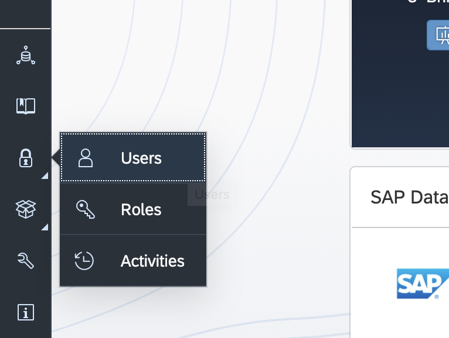
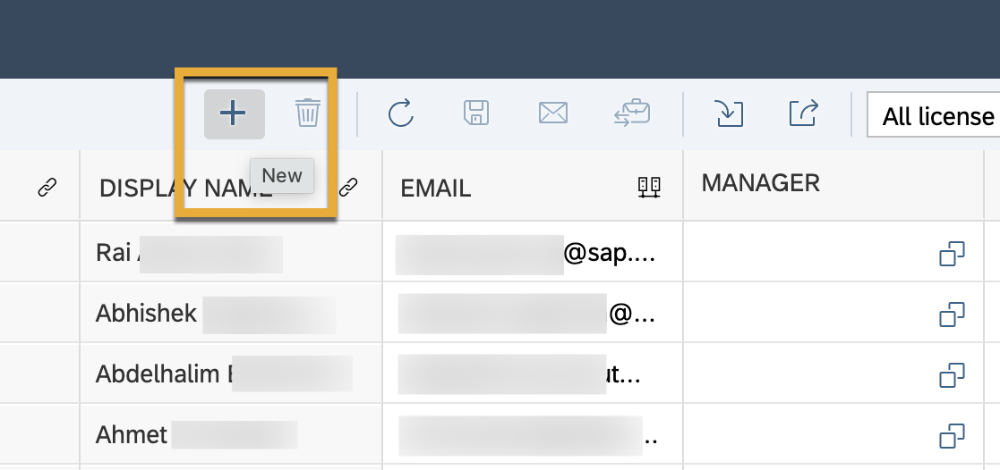
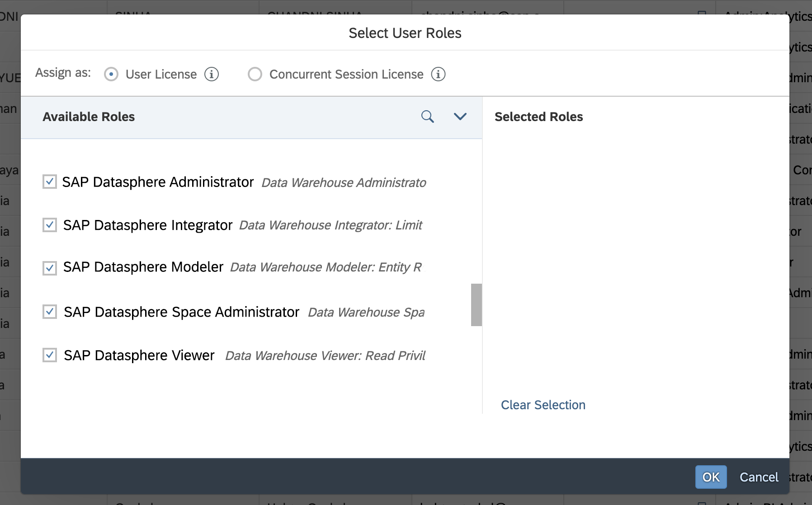

---Datasphere
parser: v2
auto_validation: true
time: 10
tags: [ tutorial>beginner, software-product>sap-data-warehouse-cloud]
primary_tag: software-product>sap-data-warehouse-cloud
---

# Add Users and Assign Roles in SAP Datasphere
<!-- description --> Add new users and assign roles to them in SAP Datasphere.

## Prerequisites
 - You have [signed up for a SAP Datasphere free tier tenant.](data-warehouse-cloud-1-begin-trial)
 - You have [familiarised yourself with the SAP Datasphere interface.](data-warehouse-cloud-2-interface)

## You will learn
  - How to add users into your SAP Datasphere tenant
  - How to assign roles to users
  - How to edit users in bulk

  You can also follow the steps in this tutorial by watching this video. Please note that SAP Data Warehouse Cloud has evolved into SAP Datasphere. While this video references SAP Data Warehouse Cloud, the content applies to SAP Datasphere.

  <iframe id="kmsembed-1_8xz2d1e5" width="421" height="300" src="https://video.sap.com/embed/secure/iframe/entryId/1_8xz2d1e5/uiConfId/30317401/pbc/122287171/st/0" class="kmsembed" allowfullscreen webkitallowfullscreen mozAllowFullScreen allow="autoplay *; fullscreen *; encrypted-media *" referrerPolicy="no-referrer-when-downgrade" sandbox="allow-downloads allow-forms allow-same-origin allow-scripts allow-top-navigation allow-pointer-lock allow-popups allow-modals allow-orientation-lock allow-popups-to-escape-sandbox allow-presentation allow-top-navigation-by-user-activation" frameborder="0" title="T03 - Add Users & Assign Roles"></iframe>

---

### Go to the security page

1.	To add users, first click on the security icon on the bottom left, and click on **Users**.

    

2. This takes you to the **Security** page, where you can see an overview of all the users in your SAP Datasphere tenant.

### Add users

To start adding users, follow these steps:

1. Click on the + icon or just start filling in the blank row along the bottom.

2.	Then enter the User ID. This must be unique, and no two users can have the same ID.

3.	Next, enter the person's first and last name, followed by the display name. This is the name that will be displayed throughout the system.

4.	Now fill in the user's e-mail. This is the e-mail address that notifies the user they have an account in your organisation's SAP Datasphere tenant. Additionally, this will also be the new user's login email ID.

### Assign roles

The next step is to assign roles to your users. The following standard roles are available in SAP Datasphere.

•	**System Owner** - Includes all user privileges to allow unrestricted access to all areas of the application. Only one user in the system can be assigned to this role, and it must always be assigned to a user.

•	**SAP Datasphere Administrator** - Can create users and Spaces and has full privileges across the whole of the SAP Datasphere tenant.

•	**SAP Datasphere Space Administrator** - Manages all aspects of their Spaces and can create data access controls and use the Content Network

•	**SAP Datasphere Integrator** - Can create and edit connections, database users, and associate HDI containers in Spaces of which they are a member.

•	**SAP Datasphere Modeler** - Can create and edit objects in the Data Builder and Business Builder in Spaces of which they are a member.

•	**SAP Datasphere Viewer** - Can view objects in Spaces of which they are a member.

You can either click on the two squares icon to see all the available user roles or start typing in the role in order to select it. Once you select all the relevant roles for your user, click on **OK** to confirm.

Once you're done, don't forget to click on the save icon on the top right of your screen. You can also delete any users from your warehouse by selecting the user and clicking on the delete icon. Further along, we have a resend email button. This is in case your users missed their access email and need another one. And finally, there is the button to assign a system owner.

> You can only assign one system owner in your SAP Datasphere tenant.

### Edit users in bulk

If you wish to add multiple users at once, you have the option to import from a CSV. Simply click on the **Import Users** icon on the top right and upload your CSV file. It is also possible to export multiple users into a CSV file by clicking on the Export Users icon.

> **Well done!**

> You have completed this tutorial and now know how to add users and assign them roles in SAP Datasphere.

### Test yourself

---
